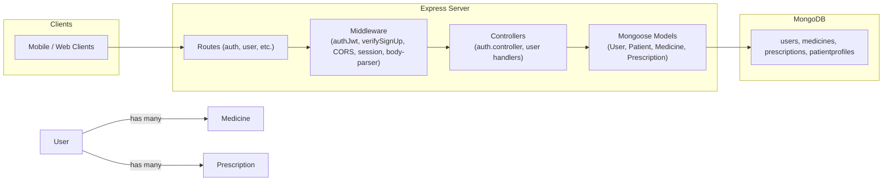

# Smappcare API


## Technology Stack

- **Runtime**: Node.js (v14.0.0 or higher)
- **Framework**: Express.js
- **Database**: MongoDB with Mongoose
- **Authentication**: JWT (JSON Web Tokens)
- **Security**: bcryptjs for password hashing
- **Containerization**: Docker
- **Additional**: CORS, cookie-session, axios

## Installation

1. Clone the repository:
   ```bash
   git clone https://www.github.com/usaidam1n/smapp-server.git
   cd smapp-server
   ```

2. Install dependencies:
   ```bash
   npm install
   ```

3. Create a `.env` file in the root directory with the following variables:
   ```
   PORT=3001
   MONGODB_ATLAS_URL=<your-mongodb-connection-string>
   COOKIE_SECRET=<your-session-secret>
   JWT_SECRET=<your-jwt-secret>
   ```

4. Start the server:
   ```bash
   npm start
   ```

The API will be available at `http://localhost:3001`

## API Endpoints

### Authentication Routes
- `POST /api/auth/signup` - Register a new user
- `POST /api/auth/signin` - Login user and receive JWT token
- `POST /api/auth/signout` - Logout user and clear session

### User/Medicine Routes
- `GET /api/get-meds` - Retrieve medicines for a user (requires authentication)
- `POST /api/save-meds` - Create a new medicine reminder
- `GET /api/test/admin` - Admin-only test endpoint (requires authentication and admin role)

### Patient Profile
- Patient profile management with health metrics including weight, height, blood group, and contact information

## Project Structure

```
smapp-server/
├── config/              # Configuration files
│   ├── auth.config.js   # Authentication configuration
│   └── db.config.js     # Database configuration
├── controllers/         # Request handlers
│   └── auth.controller.js
├── middlewares/         # Express middlewares
│   ├── authJwt.js       # JWT verification middleware
│   ├── verifySignUp.js  # Signup validation middleware
│   └── index.js
├── models/              # Mongoose schemas
│   ├── user.model.js
│   ├── patient.model.js
│   ├── meds.model.js
│   ├── prescription.model.js
│   └── index.js
├── routes/              # API routes
│   ├── auth.routes.js
│   └── user.routes.js
├── server.js            # Application entry point
├── Dockerfile           # Container configuration
└── package.json         # Dependencies
```

## Docker Support

The application includes Docker support for containerized deployment:
```bash
docker build -t smappcare .
docker run -p 3001:3001 --env-file .env smappcare
```

## Development

To run the server in development mode with auto-reload:
```bash
npm install -D nodemon
npx nodemon server.js
```

## Security Notes

- All passwords are encrypted using bcryptjs
- JWT tokens are used for session authentication
- CORS is configured for secure cross-origin requests
- Admin-only endpoints require both JWT verification and admin role validation
- MongoDB Atlas is recommended for production deployments

## License

MIT

